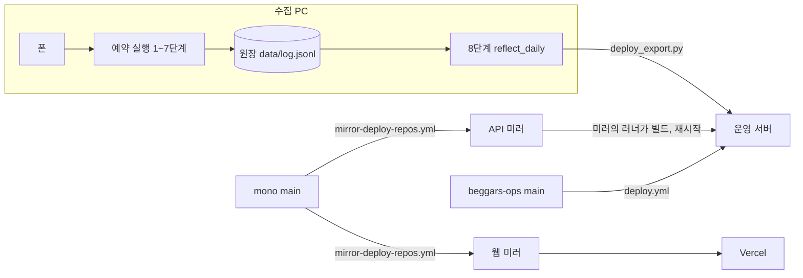

<!-- 원본: tracker docs/public/ARCHITECTURE.md — 여기서 고치지 않는다 -->
# 구조: 저장소, 도는 길, 그리고 2026-09-29에 정한 것

- 갱신: 2026-09-29
- 읽는 사람: 이 프로젝트가 지금 어떻게 생겼는지 한 장으로 보려는 사람
- 일을 어떤 순서로 하는지는 [`WORKFLOW.md`](WORKFLOW.md)에 있다. 이 문서는 모양과 이유만 적는다

규칙의 근거는 ADR에 있다. 여기서는 되풀이하지 않고 링크만 건다.
ADR과 이 문서가 어긋나면 ADR이 이긴다.

## 1. 저장소와 역할

| 저장소 | 공개 | 담는 것 | 사람이 고치나 |
|---|---|---|---|
| mono `woowacourse-teams/2026-to-discount` | 공개 | `api/`, `web/`, 공개 문서. 코드와 공개 문서의 정본 | 예 |
| 미러 `nn98/delivery-discount-api`, `nn98/delivery-discount-web` | 공개 | mono에서 복사된 배포 입력 | 아니오 |
| tracker `nn98/delivery-discount-tracker` | 비공개 | 수집기, 원장, 운영 문서, **모든 문서의 원본**(`docs/public/`) | 예 |
| beggars-ops `nn98/beggars-ops` | 비공개 | 운영 콘솔(현황 수집, 배너 제안 승인, 알림) | 예 |

mono는 tracker 작업 사본 안의 `mono/`에 따로 체크아웃한다. 저장소는 둘이지만 한 폴더에서 일한다.
그래서 tracker 테스트가 옆의 mono를 읽어 둘이 맞는지 볼 수 있다.

## 2. 실제로 도는 길

셋이다. 데이터, 코드, 운영 콘솔. 서로 다른 길로 서버에 닿는다.

### 2-1. 데이터: 수집 PC → 원장 → export → 서버

1. 수집 PC가 예약 시각(00:01, 08:30, 15:55)에 `scripts/run_routine.py`를 돌린다.
   1단계는 pytest다. 실패하면 그 회차 수집을 통째로 건너뛴다
2. 2~7단계가 폰으로 앱을 읽어 원장 `data/log.jsonl`에 덧붙인다
3. 8단계 `reflect_daily --apply`가 원장에서 export를 만들고 `scripts/deploy_export.py`로 서버에
   바로 올린 뒤 reload한다. 원장, export, 전수 기록(`data/sweeps.jsonl`)은 tracker에 자동 커밋된다

mono를 거치지 않는다. 2026-09-01부터 그렇다. 다른 데이터 배포 경로는 없다. 올리기 전에 서버 파일보다 낡았는지 본다(`check_deploy`).
배너와 기프티콘은 서버 파일이 유일본이다. 저장소에 두지 않는다.

### 2-2. 코드: mono → 미러 → API 러너 / Vercel

1. 사람이 mono `main`에 push한다
2. `mirror-deploy-repos.yml`이 `api/`, `web/`을 미러 저장소 둘로 복사한다
3. API 미러의 워크플로가 그 미러에 붙은 러너에서 빌드하고 재시작한다. 웹 미러는 Vercel이 배포한다

mono 자신에게는 배포 워크플로도 러너도 없다. 검사(`check-api`, `check-web`,
`check-project-structure`)는 GitHub 호스팅 러너에서만 돈다.

### 2-3. 운영 콘솔: beggars-ops → 서버

beggars-ops `main`에 push하면 그 저장소의 `deploy.yml`이 콘솔 파일을 서버에 올린다.
배포는 CI에 막혀 있다: `deploy.yml`은 `workflow_run`으로 CI가 성공했을 때만 돈다.
반면 mono 미러 배포(`mirror-deploy-repos.yml`)는 `push: main`에 바로 걸려 검사를 기다리지 않는다.
서버에서는 현황 수집기가 5분마다 돌고, 배너 제안 승인이 `banners.yml`을 고친 뒤 API를 reload한다.
콘솔 코드의 정본은 beggars-ops 하나다.

## 3. 문서가 흐르는 길

코드와 같은 모양이다. 코드는 mono → 미러, 문서는 tracker → mono.

1. tracker `docs/public/`에서 쓴다. 첫 줄에 전파 표식을 단다
2. `python scripts/publish_docs.py`로 무엇이 바뀌는지와 민감 정보를 본다
3. `python scripts/publish_docs.py --apply`로 mono `docs/`의 같은 자리에 쓴다
4. mono에서 커밋하고 push한다. 그다음 tracker를 커밋하고 push한다

`docs/public/` 밖의 tracker 문서는 나가지 않는다. mono에서 전파본을 고치면 다음 전파에 덮인다.
mono에 원래 있던 문서(설계, 앱별 ADR, 지표)는 mono에서 그대로 고친다.

민감 정보 검사는 두 겹이다. 전파할 때 `docs/public/`의 파일을 보고,
tracker CI가 mono가 추적하는 파일 전부를 다시 본다. 서버 안쪽 경로, 계정과 키 파일 이름,
토큰, 러너 이름이 걸린다. 운영 도메인은 이미 공개된 주소라 막지 않는다.

## 4. 테스트 관문

| 어디서 | 무엇을 돌리나 | 실패하면 |
|---|---|---|
| 수집 PC 예약 실행 1단계 | `pytest tests -q -m "not ci_only"` | 그 회차 수집을 건너뛴다 |
| tracker CI(`tests.yml`, push마다) | mono를 체크아웃하고 `pytest -q` 전부 | 슬랙 |
| tracker CI(`weekly.yml`, 월요일 09:00 KST) | 원장 드리프트와 다시 훑을 플랫폼 | 슬랙 |
| mono CI | API 테스트, 웹 테스트와 빌드, 구조 문서 최신 여부 | GitHub, 일부는 슬랙(5절) |
| mono push 전 훅 | 구조 문서 최신 여부 | push가 막힌다 |

`ci_only`는 mono 작업 트리와 비교하는 테스트에 붙인다. 전파본이 원본과 같은지,
mono에 수집기 사본이 없는지, mono에 민감 정보가 없는지가 그렇다.
수집 PC에서는 빼고 CI에서는 돈다. 이유는 6절에 있다.

## 5. 경보가 가는 곳

경보는 슬랙 운영 채널 하나로 모은다. 채널마다 따로 보면 아무도 안 본다.

| 무엇이 | 언제 |
|---|---|
| 수집 PC 예약 실행 | 시작, 실패, 재시도, 완료 |
| tracker CI(`tests.yml`, `weekly.yml`) | 실패 |
| mono CI(`check-api`, `check-web`, `check-project-structure`, `mirror-deploy-repos`) | 실패 |
| 서버의 현황 수집기(beggars-ops) | 새 ERROR, 배포 실패, 5xx 폭주, API 멈춤, 디스크, 인증서, 분석 이벤트 전달 실패 |

미러 배포의 실패는 서버 현황 수집기가 "배포 실패"로 알린다.

## 6. 2026-09-29 결정과 이유

각 항목은 무엇을 정했는지, 왜인지, 무엇을 치르는지 순서로 적는다.

### mono는 공개 정본이고 수집기를 싣지 않는다

- 무엇: 코드와 공개 문서의 정본은 mono다. mono `tracker/`에는 README 한 장만 둔다.
  근거는 [ADR-002](decisions/ADR-002-mono-is-the-public-source.md), 이전 구조는 [ADR-001](decisions/ADR-001-monorepo-consolidation.md)
- 왜: 코드는 이미 mono → 미러로만 흐르고 있었다. 반대로 mono의 수집기 사본은 09-28 실측에서
  문서 10개가 갈라지고 36개가 빠져 있었고 export 사본은 09-18에 멈춰 있었다. 아무도 읽지 않는 사본이었다
- 대가: 공개 저장소만 봐서는 수집 규칙을 볼 수 없다. 판독 계약이 궁금한 외부 독자는 문서로만 안다

### 문서는 한 방향으로 흐른다

- 무엇: 문서는 tracker `docs/public/`에서 쓰고 mono로 전파한다. 반대 방향은 없다
- 왜: 문서에는 서버 경로, 계정 파일, 러너 이름이 섞이기 쉽다. 공개 저장소에서 바로 쓰면 한 번의
  커밋으로 공개된다. 쓰는 자리를 비공개에 두면 내보내기 전에 검사할 수 있다
- 대가: mono에서 전파본을 고치면 덮인다. 공개 문서 하나를 고치는 데 커밋이 두 저장소에 하나씩 든다

### 죽은 배포 워크플로와 mono 서버 러너를 걷어냈다

- 무엇: mono `deploy-api.yml`, `deploy-data.yml`을 지우고 mono에 붙어 있던 운영 서버 러너를 해제했다.
  tracker의 수동 워크플로 `Deploy Data`도 지웠다. 데이터 배포는 `deploy_export.py` 하나다
- 왜: 둘 다 실제 배포 경로가 아니었다. 데이터 워크플로는 09-18 이후 돈 적이 없고 API는 미러가 배포한다.
  그런데 누가 수동 실행 버튼을 누르면 멈춘 코드가 운영을 덮는다. 공개 저장소에 운영 서버 러너가
  붙어 있는 것 자체가 위험이다
- 대가: 미러가 멈추면 mono에서 바로 배포할 폴백이 없다. 러너를 되살리려면 새 등록 토큰으로 다시 등록해야 한다

### 주간 점검을 tracker로 옮겼다

- 무엇: mono `weekly-check.yml`을 지우고 같은 검사를 tracker `weekly.yml`로 옮겼다
- 왜: mono에는 원장의 낡은 사본만 있었다. 원장 드리프트 검사는 pytest 수집 단계에서 먼저 죽어
  한 번도 돌지 못했고, 몇 주째 빨간 CI가 진짜 빨강을 묻었다. 진짜 원장이 있는 자리에서 돌아야 한다
- 대가: 공개 저장소의 Actions 탭에서는 주간 점검 결과가 안 보인다

### tracker의 운영 콘솔 사본을 지웠다

- 무엇: tracker의 콘솔 사본 셋(현황 수집기, 승인 반영기, 대시보드 HTML)과 그 테스트를 지웠다.
  정본은 beggars-ops다. 사본에만 있던 테스트 사례는 beggars-ops로 옮겼다
- 왜: 사본은 이미 갈라져 있었고, 정본의 머리말이 사본을 고치라고 안내하고 있었다.
  옛 사본을 서버에 올리면 새 기능을 덮는다
- 대가: 수집 루틴이 import하는 배너 규칙 파일 하나는 tracker에 사본으로 남았다.
  정본과 바이트가 같은지 보는 테스트는 아직 없다(beggars-ops 읽기 토큰을 기다린다)

### `ci_only` 표식

- 무엇: mono 작업 트리와 비교하는 테스트에 `ci_only`를 붙인다. 예약 실행 1단계는 이것을 빼고 돌고, CI는 전부 돈다
- 왜: 1단계 pytest가 실패하면 그 회차 수집이 통째로 빠진다. 09-29 00:01에 테스트 하나로 그날 수집과
  전수조사가 빠졌다. 공개 문서 한 줄이나 mono 전파를 잊은 것 때문에 같은 일이 나면 안 된다
- 대가: 전파를 잊은 것은 수집 PC가 아니라 CI에서 잡힌다. CI 실패는 슬랙으로 오지만 사람이 봐야 고쳐진다

### 자동 반영 커밋에 `sweeps.jsonl`을 싣는다

- 무엇: 8단계 자동 반영이 원장과 export에 더해 전수 기록 `data/sweeps.jsonl`도 커밋한다
- 왜: export는 전수 기록으로 끝난 오퍼를 내린다. 09-25부터 그 기록이 수집 PC에만 있어서 저장소만으로
  export를 다시 만들 수 없었다. 옮긴 주간 점검이 빨개진 원인이 이것이었다
- 대가: 자동 커밋이 파일 하나만큼 커진다. 밀린 7줄은 같은 커밋에 실었다

### 땡겨요: 공유 시트를 먼저, "한달간 보지않기"를 닫는다

- 무엇: 땡겨요 행사 링크는 공유 시트로 먼저 받고, "URL 복사하기"는 공유 버튼이 없는 페이지에서만 쓴다.
  시작 안내 화면의 "한달간 보지않기"는 공통 닫기 후보다. 글자 노드의 크기가 0이면 누를 수 있는 부모를 누른다
- 왜: URL 복사를 먼저 누르게 했더니 평소 페이지에서도 그 길을 타서 링크 모양이 바뀌었다. 공유 시트가
  원래 검증된 길이다. 안내 화면은 Compose가 그려 글자 노드가 크기 0이라, 09-22와 09-29에 두 번 수확을 막았다
- 대가: 부모 노드를 누르는 규칙은 부모가 화면의 1/4보다 크면 쓰지 않는다. 전면 광고를 누를 수 있어서다.
  그런 화면은 계속 뒤로가기로 걷는다. 새 화면 모양은 증거 화면을 테스트로 박을 때까지 또 막힐 수 있다

### 이력을 다시 쓰지 않는다

- 무엇: mono HEAD에서 민감한 줄(서버 경로, 키 파일 이름, 러너 이름)을 중립 표현으로 바꿨다. 과거 커밋은 그대로 둔다
- 왜: 이력을 다시 쓰면 지난 PR의 merged commit 링크가 깨진다. 강제 push를 해도 GitHub가 PR 참조(23개)로
  옛 커밋을 계속 들고 있어서 지워지지도 않는다. 실제 비밀값은 0건이었다. 이름과 경로뿐이다
- 대가: 옛 커밋을 뒤지면 경로와 이름이 보인다. 그래서 HEAD에서 다시 생기지 않게 CI 검사를 둔다

## 7. 더 읽을 것

| 알고 싶은 것 | 문서 |
|---|---|
| 일을 어떤 순서로 하나 | [`WORKFLOW.md`](WORKFLOW.md) |
| 저장소 구조 결정 | [ADR-001](decisions/ADR-001-monorepo-consolidation.md), [ADR-002](decisions/ADR-002-mono-is-the-public-source.md) |
| 코드 구조(자동 생성) | [`PROJECT-STRUCTURE.md`](PROJECT-STRUCTURE.md) |
| 층을 가로지를 때 지킬 계약 | [`ORCHESTRATION.md`](ORCHESTRATION.md), [`CHANGE-PROPAGATION.md`](CHANGE-PROPAGATION.md) |
| 운영 콘솔 설계 | [`design/32-ops-monitoring.md`](design/32-ops-monitoring.md) |
| 이 문서가 옮겨 오는 자리 | tracker 저장소(비공개) `docs/public/` |
