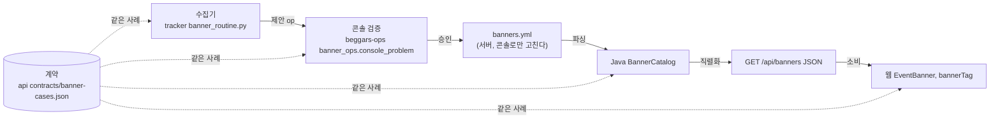

<!-- 원본: tracker docs/public/CROSS-REPO-TESTS.md — 여기서 고치지 않는다 -->
# 저장소를 건너는 테스트: 배너 한 장 따라가기

배너(웹 맨 위에 도는 행사 알림) 한 장은 저장소 넷을 지난다. 2026-09-29 전에는 저장소마다 자기 단계만 시험해서, 네 스위트가 전부 초록인 채로 수집기의 제안이 콘솔에서 통째로 거부되고 있었다. 이 문서는 배너 한 장을 끝에서 끝까지 따라가며 어디서 모양이 바뀌는지, 무엇이 깨졌는지, 이제 무엇이 그 경계를 지키는지 보여 준다.

## 한눈에



점선이 이번에 생긴 것이다. 계약 파일 하나를 네 저장소 테스트가 같이 읽는다.

## 저장소마다 자기 단계만 본다

| 저장소 | 시험하는 단계 | 감사 때 결과 | 못 보던 것 |
| --- | --- | --- | --- |
| tracker | 수집기가 제안을 **만드는가** | 107 통과 | 그 제안을 콘솔이 **받아 주는가** |
| beggars-ops | 콘솔이 **손으로 만든 op**를 받는가 | 133 통과 | 수집기가 실제로 내는 op |
| mono api | 손으로 쓴 yml을 파싱하는가 | 97 통과 | 응답 JSON 모양, 웹이 읽는 칸 |
| mono web | 손으로 쓴 배너 객체를 그리는가 | 통과(vitest로 돌리면 0건) | API가 실제로 주는 JSON |

## 배너 한 장 따라가기

예시는 둘이다. 2026-09-29 라이브 배너 `coupangeats-open-20260929-11시-릴레이`(bhc 8,000원 선착순)와, 같은 날 수집기가 낸 쿠팡이츠 행사 제안(청년피자 최대 10,000원, 60계치킨 최대 8,000원 뽑기)이다.

### 1. 수집기가 제안을 만든다

행사 제안은 옛 모양으로 나가고 있었다.

```yaml
# 전: 한 장에 두 브랜드, 문장 금액, 옛 칸 limit/items
- id: coupangeats-weekly-20260929
  brands: [청년피자, 60계치킨]
  amount: "최대 10,000/8,000원"
  limit: random
  items: [{brand: 청년피자, amount: 10000}, {brand: 60계치킨, amount: 8000}]
  startsOn: 2026-09-29
  endsOn: 2026-09-29
```

```yaml
# 후: 브랜드마다 한 장, 같은 group, 새 모양
- id: coupangeats-weekly-20260929-청년피자
  group: coupangeats-weekly-20260929
  brand: 청년피자
  amount: {won: [null, 10000], random: true}
  event: 위클리 슈퍼딜
  startsAt: "2026-09-29T00:00:00"
  endsAt: "2026-09-29T23:59:59"
```

### 2. 콘솔이 검증한다

| | 결과 |
| --- | --- |
| 전 | `옛 구조 칸(limit)은 새로 못 쓴다`. 같이 승인한 배민 핫딜 셋까지 **넷 다 미반영** |
| 후 | 통과. 수집기가 올리기 전에 같은 함수(`console_problem`)로 스스로 걸러 본다 |

### 3. banners.yml과 Java 파서

bhc 배너는 이미 새 모양이다. 옛 모양 배너(`endsOn: 2026-09-30`)가 문제였다.

| 파일 값 | 전 | 후 |
| --- | --- | --- |
| `endsOn: 2026-09-30` | `endsAt: 2026-09-30T23:59:00` | `endsAt: 2026-09-30T23:59:59` |
| `items: [...]` | 읽지 않고 버림(문구 생성 코드는 남아 있음) | 칸 자체를 지움 |

### 4. 응답 JSON

```json
// 전: 계약에 없는 칸이 새어 나왔다
{"id": "...11시-릴레이", "amount": "8,000원", "extra": "18,000원↑, 발급 선착순",
 "spec": {"items": null, "amountRange": null, "limit": null, "usage": null, "opensAt": "11:00", "empty": false},
 "own": false, "notify": false, "notifyImmediately": false}
```

```json
// 후: 칸 목록이 계약(responseKeys)으로 고정된다. 묶음 카드에는 members가 붙는다
{"id": "...11시-릴레이", "amount": "8,000원", "period": "오전 11시 오픈",
 "extra": "18,000원↑, 발급 선착순", "endsAt": "2026-09-29T23:59:59",
 "spec": {"opensAt": "11:00", "channel": null, "membership": null, "event": null, "note": null},
 "members": null}
```

행사 제안 두 장은 한 장으로 접힌다. `amount: "최대 10/8천원"`, 60계치킨만 소진이면 카드 `soldOut`은 거짓이고 `members[1].soldOut`만 참이다.

묶음은 링크(`url`), 기간(`startsAt`/`endsAt`), 플랫폼이 같은 배너들이다. 구성원마다 달라도 되는 것은 브랜드, 금액, 최소주문뿐이다(2026-09-29 사용자 결정, 확정 규칙 4절). 카드 한 장은 링크 하나, 기간 하나를 보여 주므로 그래야 카드가 정직하다. 그래서 `members`에는 `url`이 없다(`id`, `brand`, `brandLabel`, `amount`, `minOrder`, `soldOut`). 이 규칙을 어긴 살아 있는 묶음은 서버가 접지 않고 경고를 남긴 뒤 구성원을 각자 한 장으로 띄운다(계약 `group-rule-broken`).

쿠팡이츠 데일리 슈퍼딜(선착순, `coupangeats-open-...`)은 상한이다. 한 브랜드에 금액 단계가 여럿이고 수집기가 가장 큰 단계를 싣기 때문이다. 제안은 `amount: {won: [null, 10000]}`, 응답은 `"최대 10,000원"`이다(계약 `superdeal-capped`).

### 5. 웹

| 칸 | 전 | 후 |
| --- | --- | --- |
| 묶음 소진 | 대표 것 하나. 다른 구성원만 소진이면 표시 없음 | 소진된 구성원 이름만 흐리게 |
| 묶음 구성원 | 이름만 | 구성원마다 브랜드, 금액, 최소주문 |
| 표식 | `bannerTag`가 `firstCome`, `amountSpec.random` | 같다. 계약 응답으로 시험한다 |

## 어디서 깨졌고 왜 초록이었나

| # | 깨진 곳 | 왜 초록이었나 |
| --- | --- | --- |
| 1 | 수집기 행사 제안(limit, items)을 콘솔이 거부, 묶음 전체 미반영 | 수집기 테스트는 제안을 만들기만, 콘솔 테스트는 손으로 만든 op만 |
| 2 | 수집기의 "오늘 배너" 판정 8곳이 startsOn/endsOn만 봄. 자기가 올린 새 모양 배너를 못 봄 | 수집기 테스트에 startsAt 배너가 0건 |
| 3 | 새 모양 배너를 내리면 endsOn을 더해 모양이 섞이고 거부됨 | expire 테스트가 옛 모양만 |
| 4 | 종료 시각이 파서 23:59:00, Builder 23:59:59, 콘솔 힌트 T23:59 | API 테스트는 endsAt을 직접 23:59:59로 적은 경우만 |
| 5 | items를 조용히 버림 | 파서가 안 읽는 칸을 문구 코드가 읽는지 아무도 안 봄 |

## 이제 경계를 지키는 것

계약: `mono api/src/test/resources/contracts/banner-cases.json`. yml 예시(새 모양, 옛 모양, 묶음, 기간 밖), 그 예시가 만들 응답 JSON 전체, 콘솔 판정 사례, 웹과 운영 수집기가 읽는 칸 목록, `banner_ops.py` 본문 해시가 들어 있다.

| 경계 | 테스트 | 저장소 |
| --- | --- | --- |
| 수집기 제안 → 콘솔 검증 | 하루치 제안을 한 번에 `console_problem`에 넣어 통과 | tracker `test_banner_contract.py` |
| 수집기 날짜 판정 ↔ 새 모양 | 새 모양 배너를 보고, 사라진 브랜드는 내리고, 내리면 endsAt이 바뀜 | tracker `test_banner_contract.py` |
| 콘솔 판정 = 계약 | 계약의 콘솔 사례를 `console_problem`과 `apply_proposal` 두 길로 | beggars-ops `test_banner_contract.py` |
| yml → Java → JSON | 계약의 yml을 파싱, 직렬화해 응답 JSON이 글자까지 같음 | api `BannerContractTest` |
| JSON → 웹 | 계약 응답으로 표식과 묶음 소진, 웹이 읽는 칸 = 계약 목록 | web `bannerContract.test.js` |
| 묶음 규칙 | 링크, 기간, 플랫폼이 다르면 콘솔이 거부, 서버는 접지 않음 | beggars-ops `test_group_rule.py`, 계약 콘솔 사례, api `BannerGroupTest` |
| 두 벌 `banner_ops.py` | 본문 해시 = 계약 값 | tracker, beggars-ops |
| 계약 사본 | beggars-ops CI가 mono 정본과 바이트 비교 | beggars-ops CI |

웹의 `npm test`는 이제 `src/` 아래 `*.test.js`를 전부 `node --test`로 돈다. 파일을 package.json에 적는 걸 잊어도 빠지지 않고, `node:test`가 아닌 테스트 파일이 있으면 실패한다.

계약을 고칠 때는 mono에서 고치고, beggars-ops `tests/fixtures/`에 그대로 복사한다. 응답 모양을 바꾸면 API 테스트와 웹 테스트가 같이 빨개져야 정상이다.
