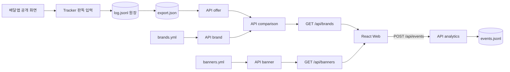
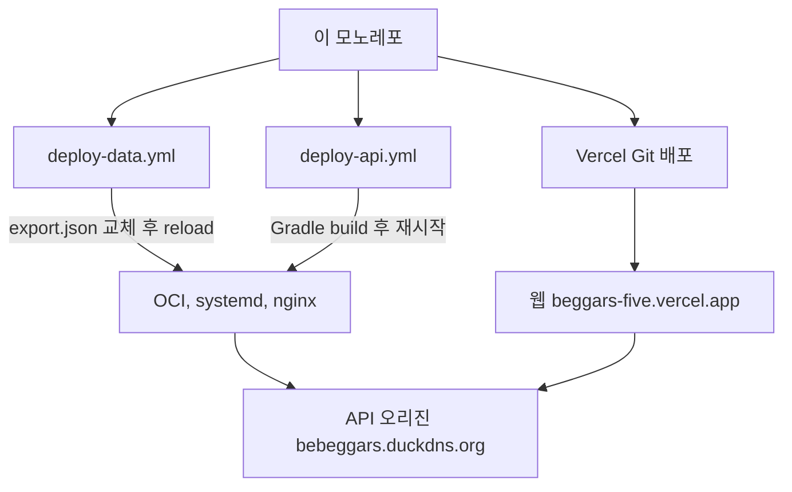

# 프로젝트 구조

<!-- structure-inputs
api/.gitattributes
api/.gitignore
api/HELP.md
api/README.md
api/build.gradle
api/gradle/wrapper/gradle-wrapper.jar
api/gradle/wrapper/gradle-wrapper.properties
api/gradlew
api/gradlew.bat
api/settings.gradle
api/src/main/java/com/discounttracker/DiscountApiApplication.java
api/src/main/java/com/discounttracker/analytics/AnalyticsEventService.java
api/src/main/java/com/discounttracker/analytics/ClientFingerprint.java
api/src/main/java/com/discounttracker/analytics/EventController.java
api/src/main/java/com/discounttracker/analytics/EventLog.java
api/src/main/java/com/discounttracker/analytics/EventRateLimiter.java
api/src/main/java/com/discounttracker/analytics/PostHogClient.java
api/src/main/java/com/discounttracker/analytics/PostHogConfiguration.java
api/src/main/java/com/discounttracker/analytics/PostHogDelivery.java
api/src/main/java/com/discounttracker/analytics/PostHogEvent.java
api/src/main/java/com/discounttracker/analytics/PostHogEventMapper.java
api/src/main/java/com/discounttracker/analytics/PostHogForwardingWorker.java
api/src/main/java/com/discounttracker/analytics/PostHogOutbox.java
api/src/main/java/com/discounttracker/analytics/PostHogProperties.java
api/src/main/java/com/discounttracker/analytics/StatsController.java
api/src/main/java/com/discounttracker/analytics/TrafficStats.java
api/src/main/java/com/discounttracker/analytics/TrafficStatsService.java
api/src/main/java/com/discounttracker/analytics/VisitEvent.java
api/src/main/java/com/discounttracker/banner/Banner.java
api/src/main/java/com/discounttracker/banner/BannerCatalog.java
api/src/main/java/com/discounttracker/brand/Brand.java
api/src/main/java/com/discounttracker/brand/BrandCatalog.java
api/src/main/java/com/discounttracker/brand/Category.java
api/src/main/java/com/discounttracker/comparison/BrandComparison.java
api/src/main/java/com/discounttracker/comparison/BrandComparisonService.java
api/src/main/java/com/discounttracker/offer/DiscountLadder.java
api/src/main/java/com/discounttracker/offer/DiscountTier.java
api/src/main/java/com/discounttracker/offer/Offer.java
api/src/main/java/com/discounttracker/offer/OfferRecord.java
api/src/main/java/com/discounttracker/offer/OfferRepository.java
api/src/main/java/com/discounttracker/offer/OfferStartupLoader.java
api/src/main/java/com/discounttracker/offer/OfferStatus.java
api/src/main/java/com/discounttracker/testdata/TestDataCatalog.java
api/src/main/java/com/discounttracker/web/BannerController.java
api/src/main/java/com/discounttracker/web/BrandController.java
api/src/main/java/com/discounttracker/web/GlobalExceptionHandler.java
api/src/main/java/com/discounttracker/web/TestDataController.java
api/src/main/java/com/discounttracker/web/WebConfig.java
api/src/main/resources/application.yml
api/src/main/resources/banners.yml
api/src/main/resources/brands.yml
api/src/main/resources/data/export.json
api/src/main/resources/static/stats.html
api/src/main/resources/test-export.json
api/src/test/http/reload.http
api/src/test/http/reloadRemoteServer.http
api/src/test/java/com/discounttracker/DiscountApiApplicationTests.java
api/src/test/java/com/discounttracker/analytics/AnalyticsEventServiceTest.java
api/src/test/java/com/discounttracker/analytics/ClientFingerprintTest.java
api/src/test/java/com/discounttracker/analytics/EventControllerTest.java
api/src/test/java/com/discounttracker/analytics/EventLogTest.java
api/src/test/java/com/discounttracker/analytics/PostHogClientTest.java
api/src/test/java/com/discounttracker/analytics/PostHogEventMapperTest.java
api/src/test/java/com/discounttracker/analytics/PostHogForwardingWorkerTest.java
api/src/test/java/com/discounttracker/analytics/PostHogOutboxTest.java
api/src/test/java/com/discounttracker/analytics/PostHogPropertiesTest.java
api/src/test/java/com/discounttracker/analytics/TrafficStatsServiceTest.java
api/src/test/java/com/discounttracker/banner/BannerCatalogTest.java
api/src/test/java/com/discounttracker/brand/BrandCatalogTest.java
api/src/test/java/com/discounttracker/comparison/BrandComparisonServiceTest.java
api/src/test/java/com/discounttracker/offer/DiscountLadderTest.java
api/src/test/java/com/discounttracker/offer/OfferRecordTest.java
api/src/test/java/com/discounttracker/offer/OfferRepositoryTest.java
api/src/test/java/com/discounttracker/testdata/TestDataCatalogTest.java
api/src/test/java/com/discounttracker/web/BrandControllerTest.java
api/src/test/java/com/discounttracker/web/GlobalExceptionHandlerTest.java
tracker/.gitattributes
tracker/.gitignore
tracker/README.md
tracker/backfill_export.py
tracker/check_brands.py
tracker/check_deploy.py
tracker/conftest.py
tracker/contract_numbers.py
tracker/export_data.py
tracker/ingest.py
tracker/parse/CONTRACT.md
tracker/record_sweep.py
tracker/schema.py
tracker/store.py
tracker/tests/test_check_brands.py
tracker/tests/test_check_deploy.py
tracker/tests/test_export_data.py
tracker/tests/test_ingest.py
tracker/tests/test_ledger_consistency.py
tracker/tests/test_schema.py
tracker/tests/test_store.py
web/.gitignore
web/README.md
web/index.html
web/package-lock.json
web/package.json
web/src/App.css
web/src/App.jsx
web/src/EventBanner.jsx
web/src/analytics.js
web/src/api.js
web/src/brandColor.js
web/src/ga4.js
web/src/logos.jsx
web/src/main.jsx
web/vite.config.js
-->

이 문서는 추적된 구조 입력 경로를 기준으로 자동 생성된다. 설명 계약은
[`ORCHESTRATION.md`](ORCHESTRATION.md), 결정 정본은
[`decisions/`](decisions/)를 따른다.

## 한눈에 보기



## 배포 경계



## 실행 단위

| 실행 단위 | 책임 | 자동 집계한 구조 입력 파일 수 |
|---|---|---:|
| `tracker/` | 판독 계약, 데이터 모델, 원장, 배포 스냅샷 | 21 |
| `api/` | 별칭 정규화, 만료 판정, 비교, 배너, 분석 | 76 |
| `web/` | 브랜드 비교 UI와 행동 이벤트 | 15 |

### Tracker

| 묶음 | 현재 경로 |
|---|---|
| 데이터 모델 | `schema.py`, `store.py` |
| 원장 운용 | `ingest.py`, `backfill_export.py`, `check_deploy.py` |
| 내보내기 | `export_data.py` |
| 일관성 검사 | `check_brands.py` |
| 판독 계약 | `parse` |
| 테스트 설정 | `conftest.py` |
| 검증 | `tests` |
| 기타 현재 모듈 | `contract_numbers.py`, `record_sweep.py` |

공개 모노레포에는 수집 실행 원본인 `capture/`, `tracker.py`, `dashboard.py`,
`config/`, `ref/`가 의도적으로 없다. 이 경계는
[`ADR-001`](decisions/ADR-001-monorepo-consolidation.md)에 고정돼 있다.

### API

패키지는 기술 계층이 아니라 도메인 책임으로 나뉜다.

| 패키지 | 책임 | Java 소스 수 |
|---|---|---:|
| `analytics/` | 행동 이벤트 수집과 트래픽 집계 | 17 |
| `banner/` | 당일 행사 로드와 날짜 판정 | 2 |
| `brand/` | 대표명, 별칭, 카테고리, 플랫폼 링크 | 3 |
| `comparison/` | 브랜드 단위 결합과 정렬 | 2 |
| `offer/` | 원장 스냅샷 적재, 만료 판정, 오퍼 선택 | 7 |
| `testdata/` | 검수용 더미 데이터, 오류를 일부러 섞는다 | 1 |
| `web/` | HTTP 엔드포인트와 CORS | 5 |

HTTP 경계:

- `GET /api/banners`
- `GET /api/brands`
- `GET /api/stats/traffic`
- `GET /api/test/brands`
- `GET /api/test/faults`
- `POST /api/events`
- `POST /api/reload`

### Web

| 모듈 | 책임 |
|---|---|
| `App.css` | 서비스 전체 스타일 |
| `App.jsx` | 브랜드 비교, 분류, 검색, 상세 |
| `EventBanner.jsx` | 당일 행사 배너 |
| `analytics.js` | 자체 행동 이벤트 |
| `api.js` | 브랜드와 배너 API 호출 |
| `brandColor.js` | 배너 색 파생 |
| `ga4.js` | 임시 GA4 측정 |
| `logos.jsx` | 브랜드와 플랫폼 로고 |
| `main.jsx` | React와 분석 도구 진입점 |

`public/`은 런타임 자산이지만 대형 로고 목록은 구조 문서에서 제외한다.

## 갱신 방법

```bash
python3 scripts/generate_project_structure.py
python3 scripts/generate_project_structure.py --check
```

생성 시각과 환경별 절대 경로를 넣지 않으므로 같은 Git 상태에서는 같은 문서가
생긴다. CI의 `--check`는 구조에 영향을 주는 소스 변경 뒤 이 문서가 갱신되지
않았으면 실패한다.
