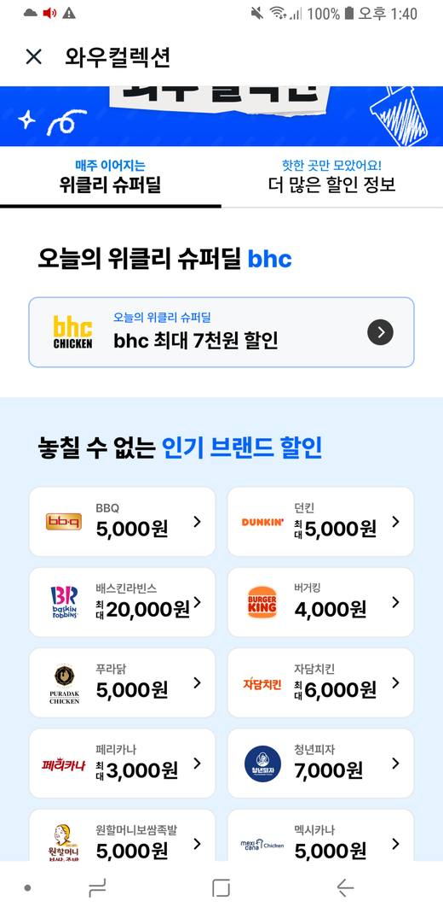
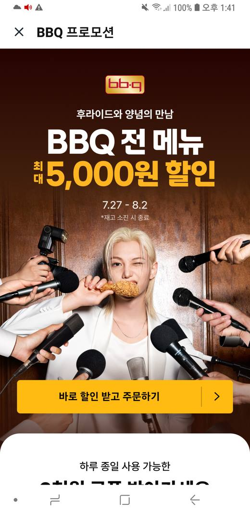
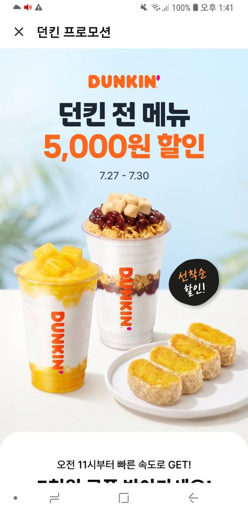
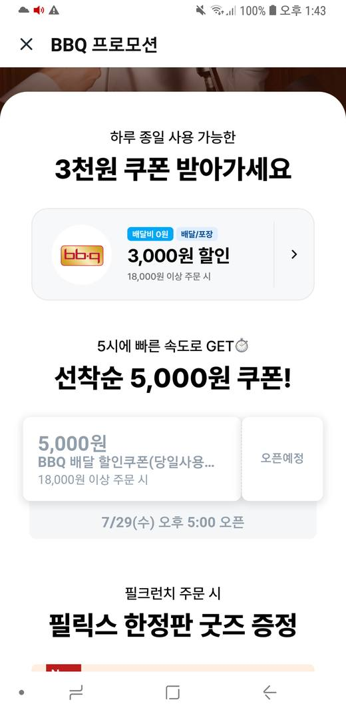
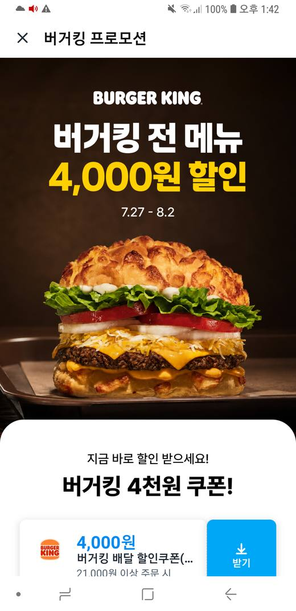
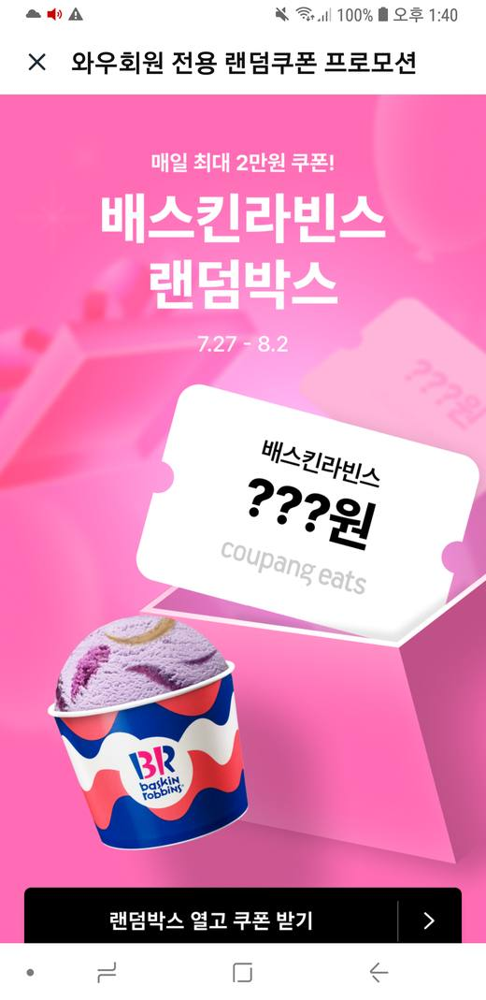
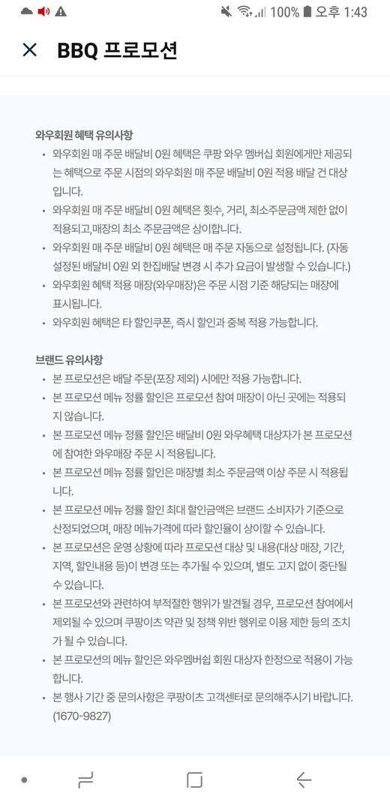

# 쿠팡이츠 브랜드 할인 해부 — 표시 금액과 실제 할인이 다른 이유

조사일: 2026-07-29 · 대상: 쿠팡이츠 Android 앱(실기 SM-G885S, ADB 연결)
관련: [ADR-010](../decisions/ADR-010-reject-internal-api.md),
[ADR-011](../decisions/ADR-011-deeplink-entry-over-tap-path.md),
[ADR-014](../decisions/ADR-014-coupangeats-record-guaranteed-floor.md)

## 왜 조사했나

원장에 쌓은 쿠팡이츠 금액이 실제로 받는 할인과 자주 어긋난다. 목록에
"5,000원"이라 적혀 있어도 실제로는 랜덤뽑기이거나, 특정 시간에만 열리는
선착순이거나, 메뉴 정률 할인의 상한선인 경우가 있었다.

**"쿠팡이츠 5,000원"이 무엇을 뜻하는지 확정하지 못하면 앱 간 비교 자체가
성립하지 않는다.** 이 문서는 그 구조를 해부하고, 무엇을 기록해야 비교
가능한 값이 되는지 정한다.

## 조사 대상 화면

앱 내 **와우컬렉션**(`와우 컬렉션` > `위클리 슈퍼딜` 탭)의 "놓칠 수 없는
인기 브랜드 할인" 목록과, 각 브랜드 카드를 눌렀을 때 열리는 프로모션
상세 페이지.



목록에는 브랜드명과 금액만 뜬다. 어떤 건 `5,000원`, 어떤 건 `최대 5,000원`.

---

## 발견 1 — "최대" 배지는 양방향으로 믿을 수 없다

목록의 `최대` 유무와 상세 페이지의 `최대` 유무가 **일치하지 않는다.**
그것도 한 방향으로 틀리는 게 아니라 양쪽으로 어긋난다.

| 브랜드 | 목록 표기 | 상세 페이지 표기 | 어긋남 |
|---|---|---|---|
| BBQ | `5,000원` | `BBQ 전 메뉴 **최대** 5,000원 할인` | 목록이 최대를 **누락** |
| 던킨 | `**최대** 5,000원` | `던킨 전 메뉴 5,000원 할인` | 목록이 최대를 **추가** |
| 버거킹 | `4,000원` | `버거킹 전 메뉴 4,000원 할인` | 일치 |

 

**결론: 목록 화면만 캡처해서는 `qualifier`를 신뢰할 수 없다.** 지금 원장의
쿠팡이츠 레코드는 전부 목록 캡처에서 판독한 것이라, `qualifier` 값이
그대로는 못 쓴다.

## 발견 2 — 헤드라인 금액은 여러 쿠폰의 최댓값이다

BBQ 상세를 끝까지 내리면 헤드라인 `최대 5,000원`이 **성격이 다른 두 개**로
쪼개진다.



| 구분 | 금액 | 최소주문 | 가용성 |
|---|---|---|---|
| 하루 종일 사용 가능한 쿠폰 | **3,000원** | 18,000원 이상 | 상시 (지금 받기 가능) |
| 선착순 쿠폰 | 5,000원 | 18,000원 이상 | **7/29(수) 17:00 오픈**, 선착순, 당일 사용 |

헤드라인 `5,000원`은 **선착순 쿠폰의 금액**이다. 5시 정각에 경쟁해서 받아야
하고, 못 받으면 0원이다. **아무 때나 확실히 받을 수 있는 금액은 3,000원.**

던킨도 같은 구조다 — 상세에 `선착순 할인!` 배지와 "오전 11시부터 빠른
속도로 GET!"이 붙어 있다.

버거킹은 반대로 깨끗하다. `지금 바로 할인 받으세요!` + `받기` 버튼,
4,000원 @ 21,000원 이상. 헤드라인 = 실제.



## 발견 3 — 랜덤박스는 금액이 아예 없다

배스킨라빈스 `최대 20,000원`을 누르면 **와우회원 전용 랜덤쿠폰 프로모션**이
열린다. 쿠폰 이미지에 금액 자리가 `???원`으로 찍혀 있고, 버튼은
`랜덤박스 열고 쿠폰 받기`.



URL 키도 다르다 — 일반 프로모션은 `landing-page-v5`인데 이건
`landing-page-v4?key=WOW_LOTTERY_0727_BR`. **`WOW_LOTTERY`가 랜덤임을
명시한다.**

`최대 20,000원`은 뽑기의 상한선이다. 기댓값도 분포도 공개되지 않는다.
**비교 가능한 값이 아니다.**

## 발견 4 — "전 메뉴 N원 할인"은 사실 정률 할인이다

BBQ 상세 하단 유의사항이 실제 계산식을 밝힌다.



> 본 프로모션 **메뉴 정률 할인** 최대 할인금액은 **브랜드 소비자가 기준으로
> 산정**되었으며, **매장 메뉴가격에 따라 할인율이 상이할 수 있습니다.**

즉 `전 메뉴 최대 5,000원`은 정액 할인이 아니라 **퍼센트 할인이고,
5,000원은 브랜드 표준가 기준으로 계산한 상한**이다. 실제 매장 메뉴가가
표준가보다 싸면 할인액도 그만큼 준다.

같은 유의사항이 추가로 걸어놓은 조건:

- **배달 주문만** (포장 제외)
- **프로모션 참여 매장에서만** 적용 — 같은 브랜드라도 매장에 따라 0원
- **매장별 최소 주문금액** 이상 — 최소주문금액이 매장마다 다름
- **와우 멤버십 회원 한정**
- 와우 혜택은 타 할인쿠폰·즉시할인과 **중복 적용 가능**

## 발견 5 — 브랜드 할인 밖에도 층이 더 있다

홈 화면만 봐도 브랜드 프로모션과 무관한 할인이 따로 돈다 — 매장별
`와우할인가`(18,000원 ← 24,000원), 단품 메뉴 `65~69%` 할인. 이건 매장·메뉴
단위라 브랜드 단위 비교표에는 애초에 안 들어간다.

---

## 유형 정리

| 유형 | 판별 단서 | 헤드라인 신뢰도 | 비교 가능? |
|---|---|---|---|
| **즉시 쿠폰** | `지금 바로`, `받기` 버튼 | 헤드라인 = 실제 | ✅ 그대로 |
| **상시 쿠폰** | `하루 종일 사용 가능한` | 헤드라인에 안 나옴(하위 항목) | ✅ **이게 바닥값** |
| **선착순 시간제** | `선착순`, `N시 오픈`, `오픈예정` | 상한선, 못 받으면 0원 | ⚠️ 별도 표기 |
| **랜덤박스** | URL `WOW_LOTTERY`, `???원` | 뽑기 상한 | ❌ 불가 |
| **메뉴 정률(%)** | 유의사항 `메뉴 정률 할인` | 표준가 기준 상한 | ⚠️ 상한으로만 |
| **매장 단위 할인** | 홈/매장 화면 `와우할인가` | — | ❌ 범위 밖 |

---

## 접근 경로 — 가능한 것과 불가능한 것

### 가능: WebView URL을 ADB로 읽어낼 수 있다

쿠팡이츠 프로모션 화면은 네이티브가 아니라 **WebView**다
(`com.coupang.mobile.eatswebview.view.WebViewActivity`). 그리고 현재 URL이
액티비티 인자에 그대로 남는다.

```bash
adb shell dumpsys activity com.coupang.mobile.eats \
  | tr -d '\000' | grep -ao "webview.encodeurl=[^,}]*"
```

이걸로 화면을 옮길 때마다 URL을 읽을 수 있고, **URL 키가 곧 유형 라벨**이다.

```
목록      https://eats-mobile-web.coupang.com/promotion/landing-page-v5?key=V5_WOW_LOUNGE_0727_AC
브랜드    https://eats-mobile-web.coupang.com/promotion/landing-page-v5?key=V5_BBQ_260727
          .../landing-page-v5?key=V5_DUNKIN_260727
          .../landing-page-v5?key=V5_BURGERKING_260727
랜덤박스  https://eats-mobile-web.coupang.com/promotion/landing-page-v4?key=WOW_LOTTERY_0727_BR
```

규칙: `landing-page-v5?key=V5_<브랜드>_<YYMMDD>` / 랜덤은
`landing-page-v4?key=WOW_LOTTERY_<MMDD>_<브랜드코드>`.

**이건 판독 보조 신호로 쓸 값어치가 있다.** 캡처와 함께 URL을 같이 남기면
"이 화면이 랜덤박스였는지"를 이미지 판독에 의존하지 않고 확정할 수 있다.

### 불가능: 그 URL을 앱 밖에서 여는 것

| 시도 | 결과 |
|---|---|
| 데스크톱 `curl` (모바일 UA) | `302 → /block` |
| 기기 Chrome으로 같은 URL 열기 | 동일하게 `/block` |

앱 WebView가 들고 있는 세션이 없으면 엣지에서 막는다. UA 문제가 아니다
(기기 Chrome도 막혔다).

### 불가능: 세션을 꺼내오는 것

| 시도 | 결과 |
|---|---|
| `run-as com.coupang.mobile.eats` | `package not debuggable` |
| `su` | `su: not found` (`ro.build.type=user`, `ro.debuggable=0`) |
| 앱 WebView에 CDP 붙이기 | 앱이 `setWebContentsDebuggingEnabled`를 안 켬 — 소켓 없음 |

참고로 `@chrome_devtools_remote`(Chrome 브라우저)는 열려 있어 CDP가 붙지만,
그건 브라우저지 앱 WebView가 아니라 세션이 없어 쓸모없다.

이 경로를 뚫으려면 루팅/인증서 피닝 우회가 필요한데, **[ADR-010](../decisions/ADR-010-reject-internal-api.md)이
이미 앱 내부 API 사용을 배제했다.** 이번 조사는 그 판단을 뒤집을 이유를
찾지 못했고, 오히려 비용이 더 크다는 걸 확인했다.

### 불가능(현재): 브랜드별 딥링크 만들기

땡겨요·배민처럼 브랜드 프로모션으로 바로 가는 링크를 만들려고 시도했다.

| 시도한 링크 | 결과 |
|---|---|
| `coupangeats://webview?url=<인코딩된 프로모션 URL>` | HomeActivity로 빠짐 |
| `coupangeats://promotion?key=V5_BURGERKING_260727` | HomeActivity |
| `coupangeats://landing?key=V5_BURGERKING_260727` | HomeActivity |
| `https://share.coupangeats.com/promotion/landing-page-v5?key=...` | 앱은 열리지만(SplashActivity) 프로모션으로 안 감 |

앱에는 `share.coupangeats.com`이 **AutoVerify App Links 도메인으로 등록돼
있다**(배민의 `s.baemin.com`과 같은 자리). 즉 공유 링크 체계 자체는 있다.
다만 **와우컬렉션 프로모션 페이지에는 공유 버튼이 없어**(헤더가 X + 제목뿐)
발급받을 방법을 못 찾았다. 매장 페이지에는 공유가 있으므로, 브랜드가 아닌
매장 단위 링크는 가능성이 남아 있다.

---

## 그래서 무엇을 기록할 것인가

상세 판단은 [ADR-014](../decisions/ADR-014-coupangeats-record-guaranteed-floor.md)에
있고, 요지는 이렇다.

**헤드라인(상한)이 아니라 보장 바닥값을 기록한다.** BBQ는 5,000원이 아니라
3,000원 @ 18,000원이 비교표에 들어갈 값이다. 상한은 버리지 않고 별도
필드로 남긴다.

이미 뚫어둔 스키마([offer-detail-collection](../plans/2026-07-29-offer-detail-collection.md))에
그대로 들어간다.

```json
{
  "platform": "coupangeats",
  "brand": "BBQ",
  "amount": 3000,
  "qualifier": null,
  "min_order_amount": 18000,
  "conditions": "와우회원 전용, 배달만(포장 제외), 참여 매장 한정. 별도 선착순 쿠폰 5,000원(매일 17:00 오픈)",
  "needs_review": false
}
```

랜덤박스는 `amount: null` + `needs_review: true`로 두고 금액을 만들어내지
않는다.

## 남은 것

- **수집 비용**: 브랜드마다 상세를 열고 끝까지 스크롤해야 바닥값이 나온다.
  전수는 비현실적이라 [수집 계획](../plans/2026-07-29-offer-detail-collection.md)의
  우선순위(최대+needs_review 먼저)를 그대로 따른다.
- **시점 의존성**: 선착순 쿠폰은 오픈 시각 전후로 화면이 바뀐다. 캡처
  시각(`captured_at`)이 판독 해석에 필요하다 — 이미 기록 중.
- **매장 편차**: 최소주문금액이 "매장별"이라 브랜드 단위로는 대표값밖에
  못 적는다. 이 한계는 화면에 드러내야 한다(웹 상세 패널의 "미확인"과
  같은 취급).
- **약관**: 쿠팡 약관상 자동 수집은 제한될 수 있다. 지금 방식(사람이 보는
  화면을 캡처)은 ADR-010이 정한 선 안에 있고, 이 조사에서도 그 선을 넘지
  않았다.
